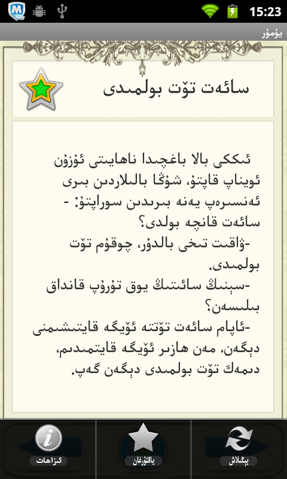
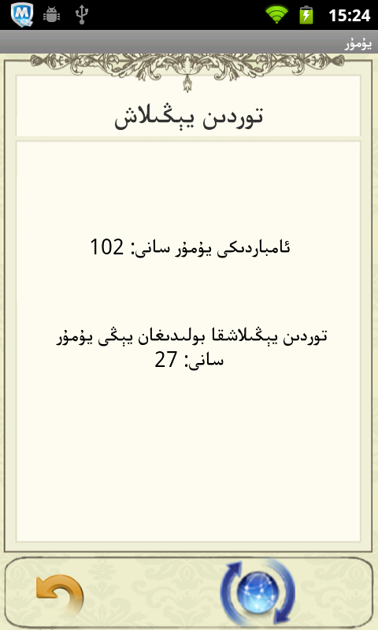

Humor
======

A humor reader in Uyghur language. The server side program is based on Microsoft .NET. Humors are saved on the server, this app pulls humors from your url of choice as a JSON file.

Screenshots
---------

How To Use
---------
Change the server address to your url of choice in values/strings.xml

Download Link:
----------
[Download from Bilkan Bazar](http://bazar.bilkan.net/App.aspx?id=174)
